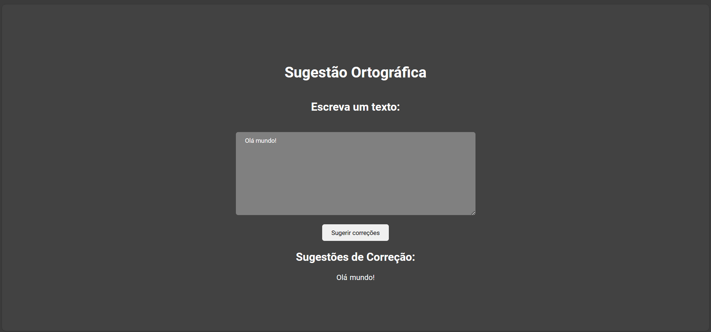
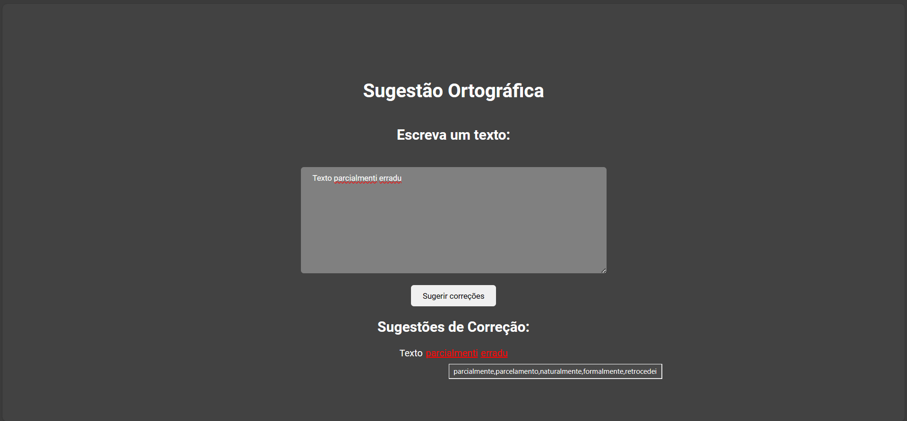

# Corretor ortográfico

**Número da Lista**: 4<br>
**Conteúdo da Disciplina**: Programação dinâmica<br>

## Alunos

| Matrícula  | Aluno                       |
| ---------- | --------------------------- |
| 19/0013354 | Gabriel Luiz de Souza Gomes |
| 19/0086521 | Eduardo Rodrigues Farias    |

## Sobre

Este projeto apresenta uma ferramenta para resolução do problema da Torre de Hanoi.

## Screenshots




## Instalação

**Linguagem**: Kotlin e Javascript<br>
**Framework**: React e Spring Boot<br>

## Uso

Deve-se ter instalado o Docker

Comandos:
Na pasta raiz execute

```
docker compose up --build
```

Abra o navegador e acesse o endereço http://localhost:5173/

## Vídeo de apresentação

[Apresentação](https://youtu.be/F5HLoi3aXVk)
